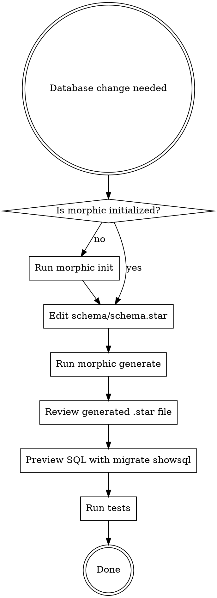

# Go Morphic

## Overview

**morphic** is the database migration tool for Go projects at Ocom. It works like Django migrations: you define your schema in Starlark, and the tool generates Starlark migration files.

**Core principle:** schema.star is the single source of truth. All database changes flow through it. RunSQL is a last resort.

## When to Use

Auto-trigger on ANY of these:

- "Add a table/model/field/column/index"
- "Change the database schema"
- "Create a migration"
- "Add a foreign key / relationship"
- "Rename a table/column"
- "Remove/drop a table/column"
- Working in a project that has `schema/schema.star`
- Working in a project that has `migrations/morphic.config.yaml`
- Any request that implies database structure changes

## The Workflow



### Step 1: Check Initialization

Look for `migrations/morphic.config.yaml`. If missing:

```bash
morphic init --database postgresql
```

This creates:
- `migrations/morphic.config.yaml`

Then create `schema/schema.star` with the initial database definition.

### Step 2: Edit schema/schema.star

This is the source of truth. ALL schema changes happen here first.

```python
database("myapp", "1.0.0")

defaults("postgresql", {
    "now": "CURRENT_TIMESTAMP",
    "new_uuid": "gen_random_uuid()",
    "zero": "0",
    "false": "false",
    "true": "true",
    "blank": "''",
})

table("users",
    fields = [
        uuid("id", primary_key=True, default="new_uuid"),
        varchar("email", 255),
        timestamp("created_at", auto_create=True),
    ],
    indexes = [
        index("idx_users_email", ["email"], unique=True),
    ],
)
```

### Step 3: Generate Migration

```bash
morphic generate --name "describe_the_change"
```

Use `--dry-run` to preview without writing files. Use `--check` to verify schema is up to date (CI use).

### Step 4: Review and Verify

```bash
# Preview the SQL that will run
morphic migrate showsql

# Run tests
go test ./...
```

### Step 5: Apply (when ready)

```bash
morphic migrate up
```

## Rules

1. **Schema-first**: Edit `schema/schema.star` before anything else. Never write SQL to change structure.
2. **Always use morphic commands**: Use `morphic migrate up`, `morphic migrate showsql`, etc. The Starlark interpreter runs migrations in-process — no build step needed.
3. **Prefer generated code unchanged**: Only modify generated migration `.star` files if you absolutely must (e.g., adding data migration logic). Try to leave them as-is.
4. **RunSQL is last resort**: Only for data migrations or complex SQL that cannot be expressed in the schema. Use `morphic generate empty --name "description"` to create the shell.
5. **Never skip generation**: Don't hand-write migration operations. Let the tool diff the schema and generate them.
6. **Name migrations descriptively**: `--name "add_user_profiles"` not `--name "update"`.

## Quick Reference: Typed Field Builtins

| Builtin | Positional Args | Example |
|---------|----------------|---------|
| `uuid(name)` | name | `uuid("id", primary_key=True, default="new_uuid")` |
| `varchar(name, length)` | name, length | `varchar("email", 255)` |
| `text(name)` | name | `text("notes", nullable=True)` |
| `integer(name)` | name | `integer("sort_order", default="zero")` |
| `bigint(name)` | name | `bigint("total_bytes")` |
| `boolean(name)` | name | `boolean("is_active", default="true")` |
| `timestamp(name)` | name | `timestamp("created_date", default="now")` |
| `date(name)` | name | `date("due_date", nullable=True)` |
| `time(name)` | name | `time("start_time")` |
| `float(name)` | name | `float("weight", nullable=True)` |
| `decimal(name, precision, scale)` | name, precision, scale | `decimal("unit_price", 10, 2)` |
| `jsonb(name)` | name | `jsonb("metadata", default="object")` |
| `bytes(name)` | name | `bytes("file_data")` |
| `serial(name)` | name | `serial("seq_no")` |
| `foreign_key(name, fk)` | name, fk dict | `foreign_key("contact_id", fk("contact", on_delete="CASCADE"))` |

All typed builtins accept `nullable`, `primary_key`, and `default` keyword arguments. Datetime types also accept `auto_create` and `auto_update`.

For types without a dedicated builtin, use the generic `field()` fallback:

```python
field("name", "citext", nullable=True)
field("data", "hstore", default="blank")
```

## Quick Reference: Foreign Keys

```python
foreign_key("author_id", fk("users", on_delete="CASCADE"))
foreign_key("created_by_id", fk("users", on_delete="PROTECT"), nullable=True)
```

Actions: `CASCADE`, `RESTRICT`, `SET_NULL`, `SET_DEFAULT`, `NO_ACTION`, `PROTECT`

## Quick Reference: Many-to-Many

```python
field("tags", "many_to_many", many_to_many="tags")
```

Generates a junction table automatically.

## Quick Reference: Indexes

```python
index("idx_users_email", ["email"], unique=True)
index("idx_posts_search", ["title", "body"], method="GIN")
index("idx_active_posts", ["created_at"], where="deleted_at IS NULL")
```

Methods: `BTREE`, `HASH`, `GIN`, `GiST`, `BRIN`

## Quick Reference: Defaults Section

Define reusable default values per database type in `schema.star`:

```python
defaults("postgresql", {
    "now": "CURRENT_TIMESTAMP",
    "new_uuid": "gen_random_uuid()",
    "zero": "0",
    "false": "false",
    "true": "true",
    "blank": "''",
    "object": "'{}'::jsonb",
    "array": "'[]'::jsonb",
})
```

Reference them in fields with `default="now"` or `default="new_uuid"`.

## Quick Reference: Type Mappings

Override SQL types per database when the built-in mapping doesn't fit:

```python
type_mappings("postgresql", {
    "money": "DECIMAL(19,4)",
    "percentage": "DECIMAL(5,2)",
})
```

## Quick Reference: Include (Schema Composition)

Import schemas from other Go modules in `schema.star`:

```python
include("github.com/company/auth-schemas", "schemas/auth.star")
```

## Available Commands

| Command | Purpose |
|---------|---------|
| `morphic init` | Bootstrap migrations directory |
| `morphic generate` | Generate migration from schema diff |
| `morphic migrate up` | Apply pending migrations |
| `morphic migrate down` | Rollback last migration |
| `morphic migrate status` | Show migration status |
| `morphic migrate showsql` | Preview SQL without applying |
| `morphic migrate dag` | View migration dependency graph |
| `morphic generate empty` | Create blank migration (for RunSQL) |
| `morphic db-to-schema` | Reverse-engineer schema from existing DB |
| `morphic struct-to-schema` | Convert Go structs to schema |
| `morphic generate dump-data` | Generate data-seeding migration |
| `morphic schema-to-sql` | Convert merged schema to SQL |
| `morphic schema-to-diagram` | Generate Markdown docs with ERD diagrams |
| `morphic from-makemigrations` | Convert old Go migrations to Starlark |
| `morphic yaml2dsl` | Convert YAML schema to Starlark DSL |

## Common Mistakes

| Mistake | Fix |
|---------|-----|
| Writing CREATE TABLE SQL directly | Edit schema.star and run `morphic generate` |
| Hand-writing migration operations | Let the tool generate them from the schema diff |
| Forgetting `--name` flag | Always name migrations: `--name "add_user_profiles"` |
| Using RunSQL for structure changes | Express it in schema.star instead |
| Editing generated migrations unnecessarily | Only modify if you genuinely must; prefer unchanged |
| Not previewing SQL before applying | Always run `migrate showsql` first |

## When RunSQL IS Appropriate

- Data migrations (backfilling values, transforming data)
- Complex constraints the schema format can't express
- Database-specific features not covered by field types (e.g., triggers, stored procedures)
- One-off fixes that don't map to schema changes

Create the shell with: `morphic generate empty --name "description"`
